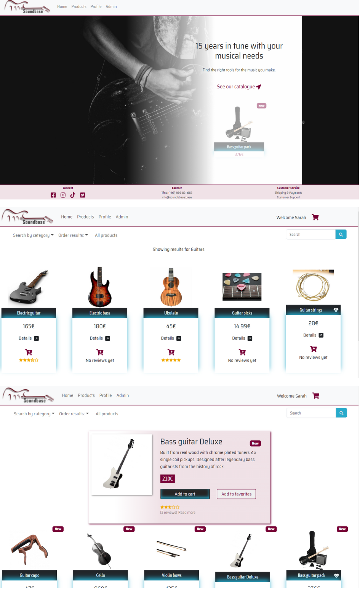
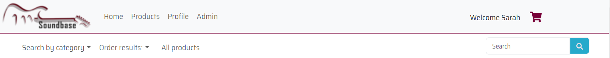
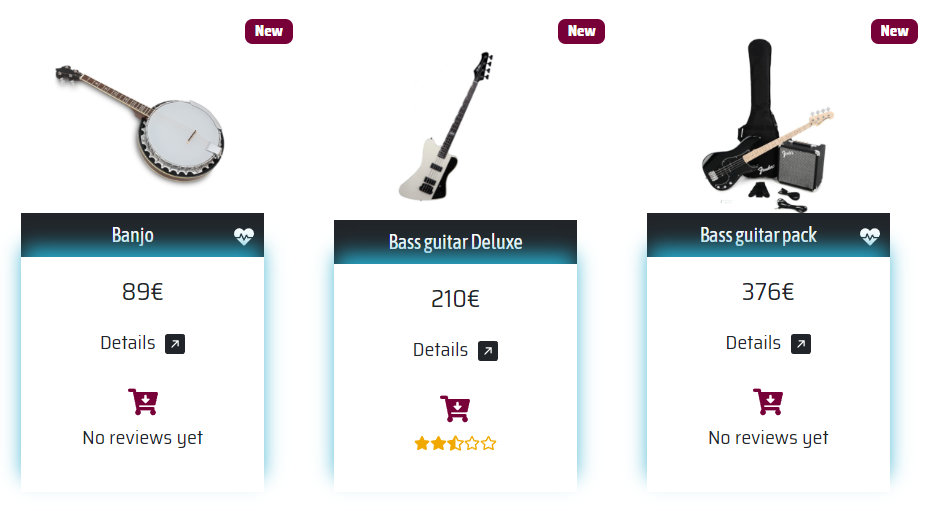
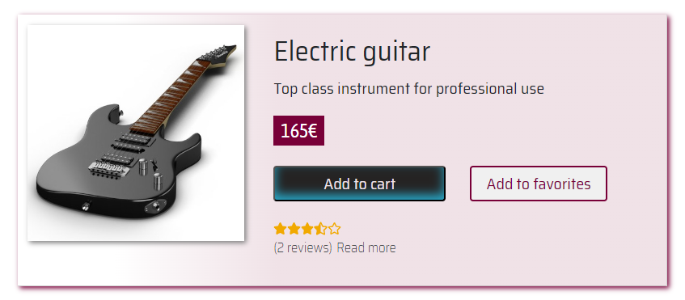
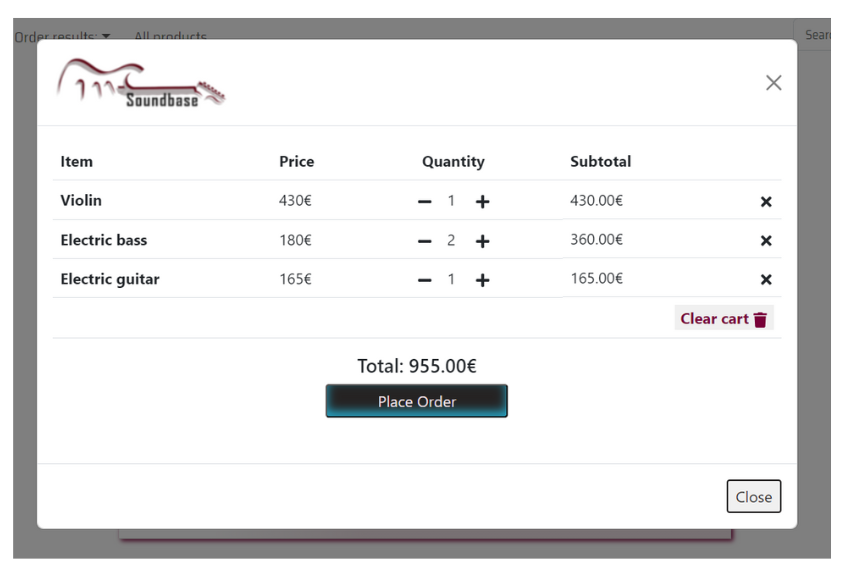
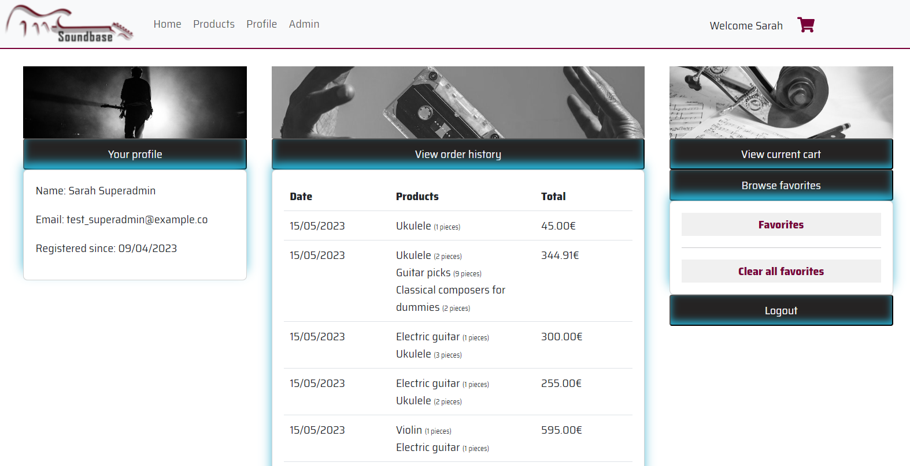
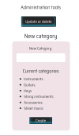
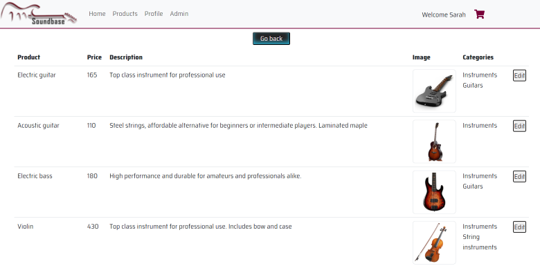

# Frontend with React for an online music shop  🎸

## 📜 Description

Course project create a **Vite-React frontend** for an online shop, using a database and backend (**MySQL** and **Sequelize**) from a previous project:  [Project Online shop backend](https://github.com/kbastamow/Project-Online-Shop-Backend-MySQL-Sequelize.git)

## 🎯 Obligatory requirements

- [x] Homepage
- [x] Product page
- [x] Registration and login 
- [x] Profile page
- [x] Viewing user details on screen
- [x] Shopping cart, adding products, viewing cart contents
- [x] Styling

## 📝Login and Registation

The login and registration are displayed as modals.

Validation is performed also on frontend to make sure the user enters all details, emails are correct forms, and password and password repeat match when registering.

(There is further validation on backend)

## ➕Extras

After my experience of building the front for the shop with Vanilla JavaScript (Github:[ Project Online Shop FrontEnd VanillaJS](https://github.com/kbastamow/project-Online-Shop-FrontEnd-VanillaJS.git)) I was keen to take advantage of React's components to manage and manipulate the user view and make the page as functional as possible.

Here are the extras:

## ✅ Homepage:

Retrieve products from back and display a random number of examples that fade in and out one after another. The loop runs ten times.

## ✅ Product page:

### Search bar

* The page displays all products by default. 
* User can search products by category.
* User can search products by name.
* User can order the products by *price*, *alphabetically*, or by *date*

### Product list

* Displays the list of products in identical cards.
* Each card can be clicked to see further details.
* The cart icon in the card adds product to the cart.
* The card displays a heart icon if the product is in favourites.
* The card displays *new* badge if the product is less than seven days old.
* The average rating of corresponding reviews are calculated and displayed in stars.

### Details about product

Clicking on individual cards shows a more detailed view where the user can:

* Read individual reviews and see the ratings.
* Add the product to their cart
* Add the product to their favourites or remove it if it's already there.

## ✅ Cart

The cart is a modal that can be opened by clicking on the cart icon next to user's name on search bar, provided the user is logged in.

In the cart, the user can

* See a list of current products and their total price.
* Add or remove more of the same product with live updating of prices.
* Delete an item from the cart.
* Clear the cart.
* Place an order.

The cart is saved in Local Storage so the data is saved even if the user logs out.

## ✅ Profile

Here the user can

* See their details
* View the history of their orders, with the total sum calculated.
* Open their current cart modal again.
* Clear their favourite product list, or browse the favourites. This action takes them back to product page and filters the items to show.

* Logout.

## ✅ Admin page

Administrators can access a page to manipulate the product catalogue.

### Creating a new product

* The admin can create a new product and upload an image for it. 
* The form is previewed together with the image preview and only sent to the database if all details have been filled in and the admin confirms the submission.
* After creating the product, the admin will see the final product card.  

### Creating a new category

* The admin can add a category.
* A validation is performed before submission to check the category doesn't already exist.  

### Updating a new product

This page is still in progress as the backend need to be modified to receive images as an update. Currently, the page shows

* A list of all the products in a more concise table form. 

* On clicking a product, a form opens where the current product details are already filled in.

The page doesn't include search or filter functions, but it would be simple to turn them into components from the product page and implement them here.

## 🔍 Notes on React Context

The functions are grouped to correspond with how the data is organised in tables in backend. Some functions query the back, whereas others simply manipulate existing data saved in State.

There is an additional context for opening and closing some modals, as I needed access to them from several different components.

## ✨ Notes on styles

The styling is admittedly a bit of a mess. It combines "vanilla" Bootstrap (mostly for layout, margins and padding), React-Bootstrap (which I installed after needing access to Modal manipulation), CSS and a tiny bit of Sass.

The project objective was to learn React and the page was built with functionality first, with no initial design for the app. Therefore the visual style is not particularly uniform, and the styling in code is rather messy.

## ▶️  How to use the project

The project is linked with a MySQL backend ([Project Online shop backend](https://github.com/kbastamow/Project-Online-Shop-Backend-MySQL-Sequelize.git)).

### 📜 Dependencies

Functionality
* Vite - React
* Axios
* React router

Styles
* React icons
* React bootstrap
* Bootstrap 5
* Sass
* Google fonts

VS Code was used to build the project.

## ©️ Author

* [kbastamow](https://github.com/kbastamow)

